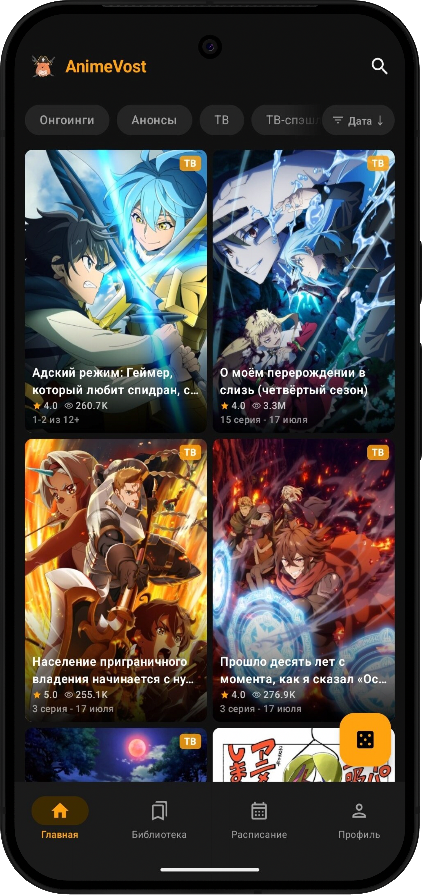
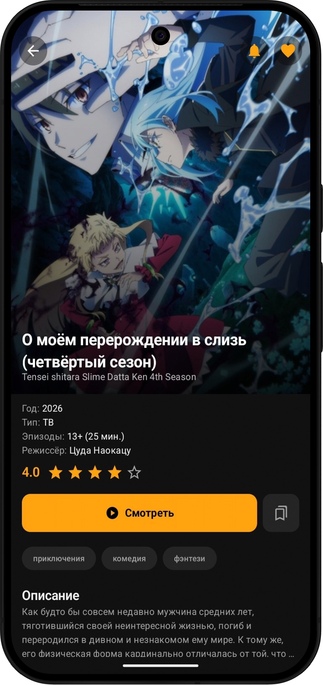
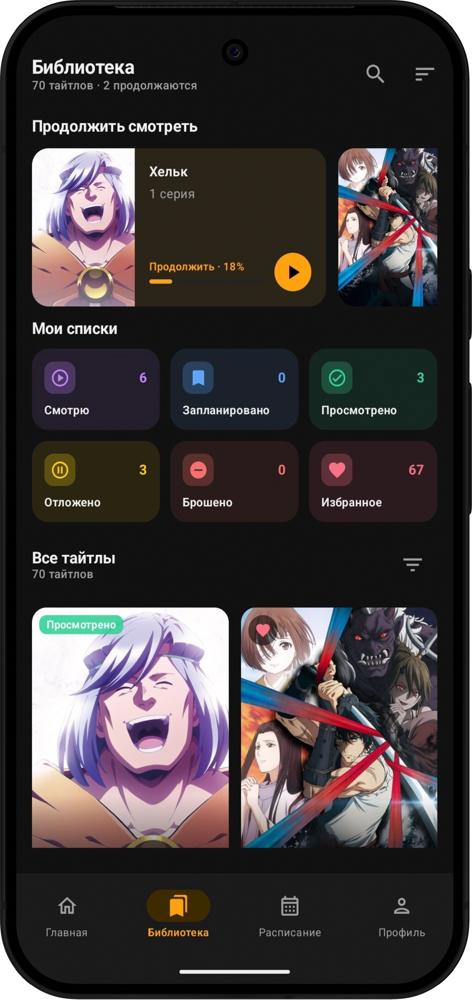
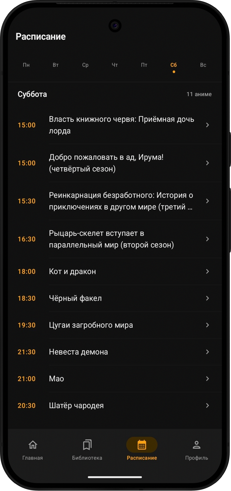

<div align="center">
  

  <h1>AnimeVost Mobile</h1>

  <p>
    Современный нативный клиент AnimeVost для Android<br>
    Смотрите аниме, следите за новыми сериями и управляйте своей библиотекой в одном приложении
  </p>

  <p>
    <a href="https://github.com/Mirsmog/animevost-mobile/releases/latest"></a>
    <a href="https://github.com/Mirsmog/animevost-mobile/releases"></a>
    <a href="https://github.com/Mirsmog/animevost-mobile"></a>
    <a href="https://github.com/Mirsmog/animevost-mobile/actions/workflows/ci.yml"></a>
    
    
  </p>

  <p>
    <a href="https://github.com/Mirsmog/animevost-mobile/releases/latest"><strong>Скачать APK</strong></a>
    ·
    <a href="#возможности">Возможности</a>
    ·
    <a href="#сборка-из-исходников">Сборка</a>
  </p>
</div>

<br>

<div align="center">
  
  
  
  
</div>

<div align="center">
  <h3>Не потеряйте AnimeVost Mobile ⭐</h3>
  <p>
    Добавьте проект в избранное, чтобы он всегда оставался под рукой.
  </p>
  <a href="https://github.com/Mirsmog/animevost-mobile">
    
  </a>
  <br>
  <sub>Кнопка Star находится вверху страницы</sub>
</div>

## О приложении

**AnimeVost Mobile** объединяет каталог, расписание, личную библиотеку и просмотр в одном быстром Android-приложении. Интерфейс полностью написан на Jetpack Compose, а воспроизведение работает на базе AndroidX Media3.

> [!NOTE]
> Это неофициальный клиент [animevost.org](https://animevost.org). Проект не связан с администрацией или командой сайта.

## Возможности

| | |
|---|---|
| 🎬 **Нативный плеер** | HLS-воспроизведение, выбор качества, жесты, скорость от 0.25x до 5x и переход к следующей серии |
| ⏭️ **Умный просмотр** | Подсказки для пропуска интро и концовки, сохранение позиции и продолжение с места остановки |
| 📚 **Личная библиотека** | Списки просмотра, избранное и история в одном разделе |
| 📥 **Скачивание серий** | Выбор качества и загрузка эпизодов на устройство |
| 🔔 **Новые эпизоды** | Фоновые уведомления о выходе серий избранных тайтлов |
| 🔎 **Каталог и поиск** | Поиск по названию, фильтры по жанру, типу и году выпуска |
| 📅 **Расписание** | Удобный список релизов по дням недели |
| 💬 **Аккаунт и комментарии** | Авторизация, профиль, просмотр и отправка комментариев |

## Скачать

<div align="center">
  <a href="https://github.com/Mirsmog/animevost-mobile/releases/latest">
    
  </a>
  <a href="https://github.com/Mirsmog/animevost-mobile/releases">
    
  </a>
</div>

Выберите APK, подходящий вашему устройству:

| Вариант | Назначение |
|---|---|
| `arm64-v8a` | Большинство современных Android-устройств, рекомендуется |
| `armeabi-v7a` | Старые устройства с 32-битным ARM-процессором |
| `x86_64` | Android-эмуляторы и устройства на x86_64 |
| `universal` | Универсальная сборка, если архитектура устройства неизвестна |

> [!TIP]
> Для установки APK может потребоваться разрешить установку приложений из выбранного браузера или файлового менеджера в настройках Android.

## Сборка из исходников

### Требования

- JDK 17
- Android SDK 35
- Git с поддержкой submodules
- Android Studio с поддержкой Android Gradle Plugin 8.7.3

### Запуск

```bash
git clone --recurse-submodules https://github.com/Mirsmog/animevost-mobile.git
cd animevost-mobile
./gradlew assembleDebug
```

Если репозиторий уже клонирован без submodules:

```bash
git submodule update --init --recursive
```

Готовые debug APK появятся в `app/build/outputs/apk/debug/`.

### Проверки

```bash
# Unit-тесты
./gradlew testDebugUnitTest

# Линтер и debug-сборка
./gradlew lintDebug assembleDebug
```

## Участие в разработке

Сообщения об ошибках, идеи и pull request приветствуются.

- [Создать issue](https://github.com/Mirsmog/animevost-mobile/issues/new)
- [Посмотреть открытые задачи](https://github.com/Mirsmog/animevost-mobile/issues)
- Перед крупным изменением сначала опишите предложение в issue

## Отказ от ответственности

Приложение является независимым неофициальным клиентом. Все права на контент, названия и товарные знаки принадлежат их законным владельцам.

<div align="center">
  <sub>Сделано с ❤️ для просмотра аниме</sub>
</div>
