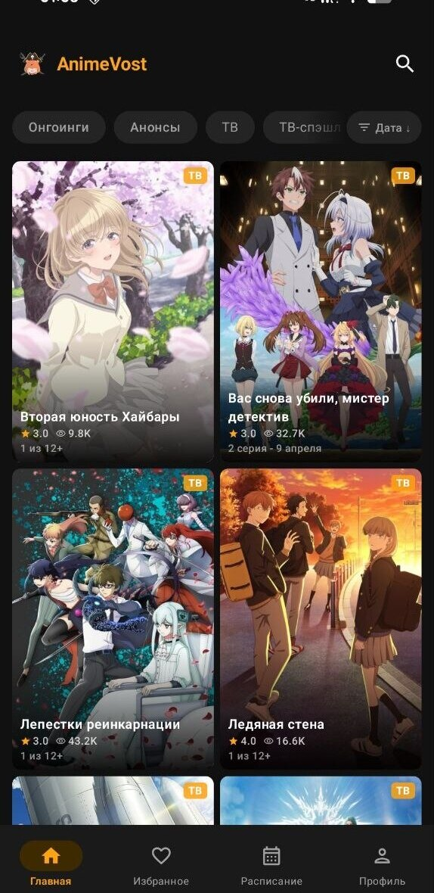
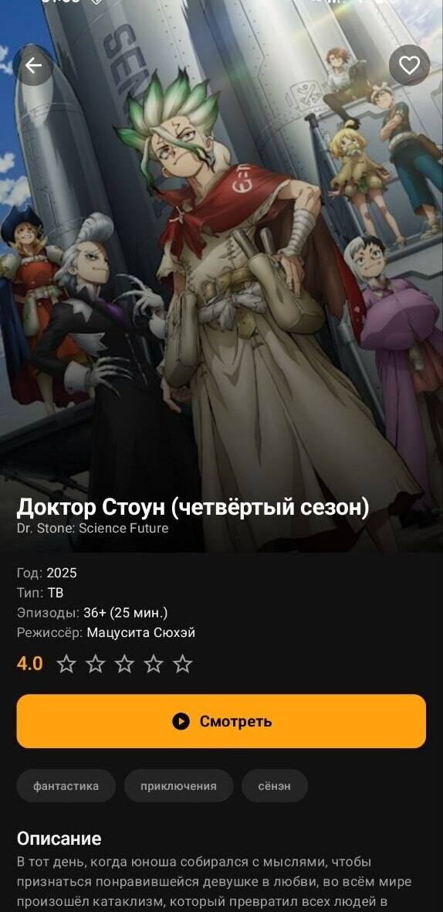
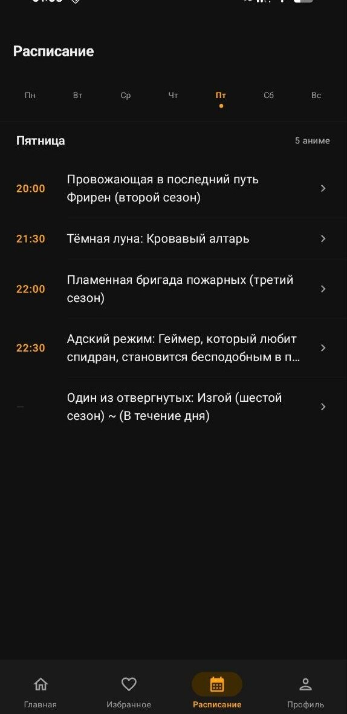
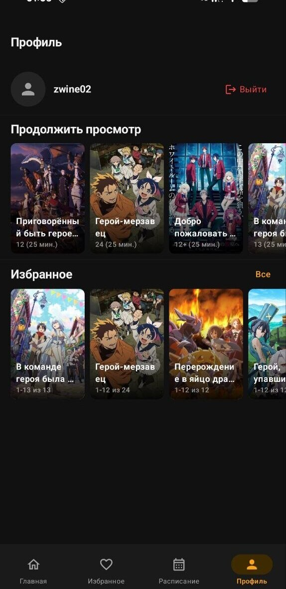

# AnimeVost Mobile

<div align="center">

[](https://github.com/Mirsmog/animevost-mobile/releases/latest)
[](https://github.com/Mirsmog/animevost-mobile/releases/latest)
[](https://kotlinlang.org)
[](LICENSE)

</div>

<div align="center">
  
  
  
  
</div>

<br>

**Неофициальный** нативный клиент [animevost.org](https://animevost.org) для Android. Написан на Kotlin + Jetpack Compose. Никакой связи с командой сайта не имеет.

## Возможности

- 🎬 Плеер с жестовым управлением, регулировкой скорости и автопереходом к следующей серии
- ⏭️ Автопропуск интро и концовки через AniSkip
- 📋 Списки просмотра — «Смотрю», «Просмотрено», «Запланировано», «Брошено»
- 🗂️ Каталог с фильтрацией по жанру, типу и году
- 🔍 Поиск по названию
- 📅 Расписание выхода новых серий
- 💬 Комментарии
- ⭐ Избранное

## Скачать

Готовые APK → **[Releases](https://github.com/Mirsmog/animevost-mobile/releases/latest)**

| APK | Для кого |
|---|---|
| `arm64-v8a` | Большинство современных устройств |
| `armeabi-v7a` | Старые 32-битные устройства |
| `universal` | Если не уверены — берите этот |

> Перед установкой разрешите установку из неизвестных источников: **Настройки → Приложения → Особые права → Установка неизвестных приложений**.

## Сборка из исходников

```bash
git clone https://github.com/Mirsmog/animevost-mobile.git
cd animevost-mobile
./gradlew assembleDebug
```

Требования: Android 8.0+ (API 26), JDK 17, Android Studio Hedgehog+.

> Для входа нужен существующий аккаунт на [animevost.org](https://animevost.org).

## Участие в разработке

Пул-реквесты приветствуются. Перед крупными изменениями лучше открыть issue.

## Лицензия

[MIT](LICENSE)
